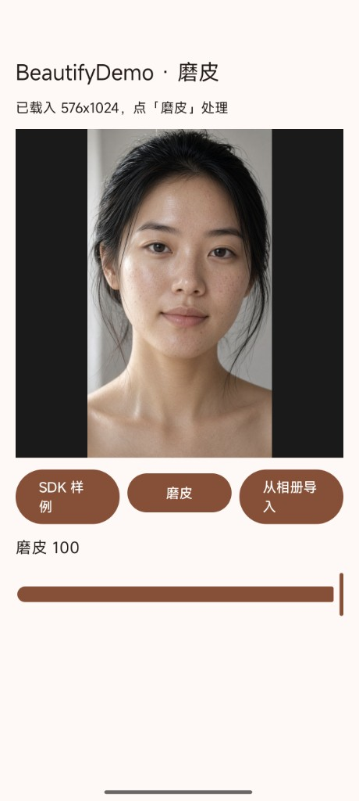

# 我通过逆向学到了 douyin 的美颜算法

打开抖音进页美颜，滑一下「磨皮」，皮肤就匀了——很多人以为这就是一层高斯模糊。真去拆，会发现完全不是。

抖音进页美颜是一整套链路。磨皮会偏糊，后面还有清晰等步骤把细节补回。这篇只分享其中**磨皮**这一环：怎么拆开的、链路长什么样、为什么这样设计。

---

## 为什么值得拆

1. **观感有门槛**：同样「磨皮 100」，随便糊一层会整脸发腻；抖音这路是蒙版 + 引导模糊 + joint + 强度标定叠出来的，斑点下去、五官边缘还在。
2. **实现不在 Java 层**：热路径在特效 native 和 composer 资源包里，只扒 UI 参数名基本摸不到算法。
3. **能对照复现**：钉住 Pass 顺序和关键强度后，静图也能跑出接近的效果；文末有前后对比。本仓库即按同一思路实现的静图 Demo。

---

## 逆向拆了什么

对象是抖音侧那套美颜引擎，磨皮相关大致拆了这些：

- **`libeffect.so`**：抖音特效 native 核心，调度、过程分辨率等从这里钉
- **composer 美颜包**：磨皮链的 GLSL、Lua 编排、脸部蒙版 / 链内 LUT / 皮肤估计用图
- **运行时对照**：核对 Pass 顺序、RT 尺寸、面板强度怎么进最终合成

结论先说：**磨皮不是单 shader**，而是一条固定多 Pass GPU 管线；面板滑条还要乘固定系数，才和线上强度观感对齐。

---

## 磨皮要解决什么

静图做人脸磨皮：检测到脸、强度大于 0，就在 GPU 上跑完整条链，输出结果图。没脸或强度过低时保留原图。

---

## 整体流程（从选图到出图）

1. **选图** → 人脸检测，拿到框和 106 点（归一化 UV）。
2. **点序转换**：检测器点序和磨皮蒙版网格点序不一致，先重排到蒙版用的那一套。
3. **驱动脸部网格**：用重排后的 106 点推出更密的网格，贴 faceMask 纹理，得到「哪里该磨」的蒙版（眼、嘴等区域权重不同）。
4. **固定处理分辨率**：磨皮在 **720×1280** 空间里算（对齐抖音侧 process 尺寸）；引导模糊、皮肤估计等用更小的 RT，省带宽也稳标定。
5. **多 Pass 磨皮** → 读回 Bitmap 显示。

点序错了，蒙版会漂；分辨率乱了，强度手感会对不上。这两步是复现观感的关键。

---

## 磨皮链：每一段在干什么

```
原图
  → 画脸部蒙版（mesh + faceMask）
  → 估皮肤 / 细化蒙版（小分辨率）
  → 引导模糊两遍
  → 按蒙版与原图混合（带一张链内 LUT）
  → joint 模糊两遍（固定强度系数）
  → 最终合成
  → 输出
```

| 阶段 | 作用 |
|---|---|
| 脸部蒙版 | 决定「磨哪里、磨多少」，避免背景、头发被一起抹平 |
| 皮肤估计 / 细化 | 在小 RT 上收紧皮肤区域，蒙版更贴肤 |
| 引导模糊 ×2 | 去斑去纹理的主手段；带引导，比裸高斯更保结构 |
| 蒙版混合 + LUT | 把模糊结果按权重掺回原图；LUT 是链内标定的一部分 |
| joint 模糊 ×2 | 再做一轮联合向的平滑，系数在资源侧写死 |
| 最终合成 | 吃面板强度；抖音侧滑条约乘 **0.85** 再进合成，直接拉满会和线上不一致 |

所以：「磨皮滑到 100」≠ shader 里写 `intensity=1.0`。漏掉系数，对拍会一直觉得「怎么比抖音猛 / 虚」。

---

## 和「一层模糊」差在哪

- **有空间蒙版**：不是全图像素一个强度。
- **有皮肤估计**：蒙版会按肤色/区域再收一刀。
- **模糊是引导式 + joint**：为的是抹匀皮肤纹理，而不是糊成一张皮。
- **强度有标定**：process 尺寸、RT 比例、0.85 系数，都是对线上手感用的。

磨完会偏糊，所以完整美颜后面还要清晰等步骤把细节捞回来；这篇只把磨皮这一环说清楚。

---

## 前后对比

同一张样例图，磨皮强度 100：

| 处理前 | 处理后 |
|:---:|:---:|
|  |  |

斑点、毛孔被压下去，脸型边缘和五官结构还在——这是蒙版 + 多 Pass，而不是整图一糊了之。

---

## Demo

本仓库即 Demo：选图 → 调强度 → 出图。明文 GLSL 与资源，逻辑对齐文中 Pass 顺序和强度标定。

https://github.com/vip001/BeatyfyDemo

---

## 小结

- 抖音磨皮在 **`libeffect.so` + composer** 里，是一条可钉死的 GPU 多 Pass 链。
- 复现重点不在「再写个模糊」，而在：**点序 → 蒙版 → 分辨率 → Pass 顺序 → 强度系数**。
- 进页美颜还有清晰等后续；磨皮只是其中一环，单独看会偏软，合链路才完整。
